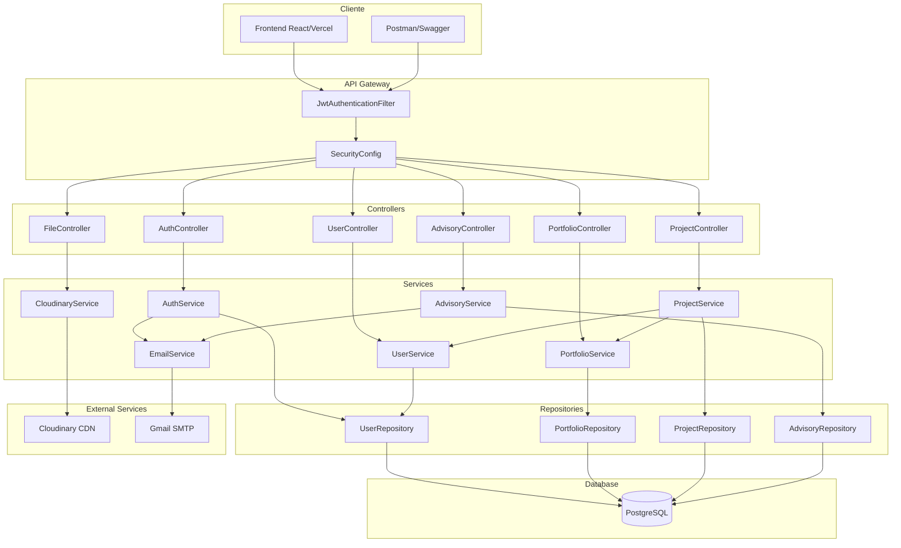
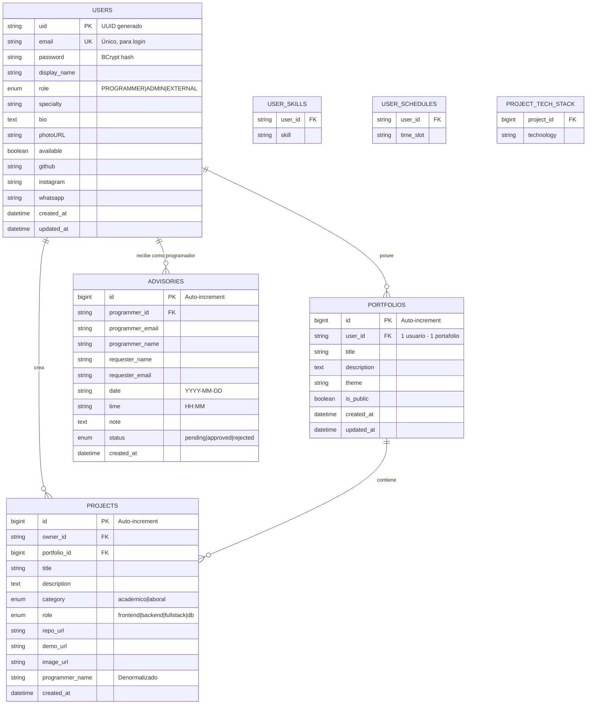

# LEXISWARE Portafolio Backend - Documentacion Tecnica Exhaustiva

<div align="center">


**API REST profesional para gestión de portafolios, proyectos y asesorías técnicas**

[Inicio Rápido](#9-configuración-y-ejecución) • [Arquitectura](#4-arquitectura-del-sistema) • [API Docs](#endpoints-completos) • [Despliegue](#despliegue-en-producción)

</div>

---

## Tabla de Contenidos

1. [Resumen del Proyecto](#1-resumen-del-proyecto)
2. [Índice de Navegación](#2-índice-de-navegación)
3. [Mapa del Repositorio](#3-mapa-del-repositorio)
4. [Arquitectura del Sistema](#4-arquitectura-del-sistema)
5. [Detalle por Carpeta](#5-detalle-por-carpeta)
   - [5.1 Módulo Advisory](#51-módulo-advisory-asesorías)
   - [5.2 Módulo Auth](#52-módulo-auth-autenticación)
   - [5.3 Módulo Config](#53-módulo-config-configuración)
   - [5.4 Módulo Files](#54-módulo-files-archivos)
   - [5.5 Módulo Portfolio](#55-módulo-portfolio-portafolios)
   - [5.6 Módulo Project](#56-módulo-project-proyectos)
   - [5.7 Módulo Users](#57-módulo-users-usuarios)
   - [5.8 Módulo Utils](#58-módulo-utils-utilidades)
6. [Detalle por Archivo](#6-detalle-por-archivo)
7. [Clases, Métodos y Funciones](#7-clases-métodos-y-funciones)
8. [Flujos Principales del Sistema](#8-flujos-principales-del-sistema)
9. [Configuración y Ejecución](#9-configuración-y-ejecución)
10. [Dependencias](#10-dependencias)
11. [Pruebas](#11-pruebas)
12. [Seguridad y Buenas Prácticas](#12-seguridad-y-buenas-prácticas)
13. [Decisiones Técnicas](#13-decisiones-técnicas)
14. [Glosario](#14-glosario)

---

## 1. Resumen del Proyecto

### Que hace el sistema?
**LEXISWARE Portafolio Backend** es una API REST que permite a desarrolladores crear y gestionar portafolios profesionales, exhibir proyectos técnicos y ofrecer servicios de asesoría/mentoría a otros usuarios.

### Problema que Resuelve
- **Fragmentación de identidad profesional**: Centraliza en un solo lugar proyectos, habilidades y disponibilidad del programador.
- **Brecha entre talento y oportunidades**: Conecta programadores con personas que necesitan mentoría técnica.
- **Gestión de solicitudes de asesoría**: Automatiza el flujo de solicitud, aprobación/rechazo y notificaciones.

### Publico Objetivo / Casos de Uso

| Actor | Casos de Uso |
|-------|--------------|
| **Programador (PROGRAMMER)** | Crear portafolio, agregar proyectos, gestionar disponibilidad, aprobar/rechazar asesorías |
| **Usuario Externo (EXTERNAL)** | Explorar portafolios, ver proyectos, solicitar asesorías |
| **Administrador (ADMIN)** | Gestionar todos los usuarios, proyectos y asesorías del sistema |
| **Reclutadores/Clientes** | Validar habilidades técnicas mediante proyectos reales |

---

## 2. Índice de Navegación

```
proyecto/
├── Configuracion
│   ├── build.gradle ────────────────── Dependencias y plugins
│   ├── settings.gradle ─────────────── Nombre del proyecto
│   ├── application.properties ──────── Configuracion principal
│   └── application-prod.properties ─── Configuracion de produccion
│
├── Contenedores
│   ├── Dockerfile ──────────────────── Imagen de la aplicacion
│   └── docker-compose.yml ──────────── Orquestacion DB + PgAdmin
│
└── Codigo Fuente (src/main/java)
    └── com.lexisware.portafolio
        ├── advisory/ ───────────────── Módulo de Asesorías
        ├── auth/ ───────────────────── Módulo de Autenticación
        ├── config/ ─────────────────── Configuraciones Spring
        ├── files/ ──────────────────── Gestión de Archivos
        ├── portfolio/ ──────────────── Gestión de Portafolios
        ├── project/ ────────────────── Gestión de Proyectos
        ├── users/ ──────────────────── Gestión de Usuarios
        └── utils/ ──────────────────── Utilidades Transversales
```

---

## 3. Mapa del Repositorio

### Árbol Completo del Proyecto

```
proyecto/
├──  build.gradle                    # Configuración de Gradle con dependencias
├──  settings.gradle                 # Nombre del proyecto Gradle
├──  gradlew                         # Wrapper de Gradle (Unix)
├──  gradlew.bat                     # Wrapper de Gradle (Windows)
├──  Dockerfile                      # Multi-stage build para producción
├──  docker-compose.yml              # PostgreSQL + pgAdmin local
├──  README.md                       # Esta documentación
├──  HELP.md                         # Ayuda de Spring Initializr
│
├──  gradle/wrapper/
│   └── gradle-wrapper.properties      # Versión de Gradle (8.x)
│
├──  src/main/java/com/lexisware/portafolio/
│   │
│   ├──  PortafolioBackendApplication.java  # Punto de entrada @SpringBootApplication
│   │
│   ├──  advisory/                   # ═══ MÓDULO: Asesorías ═══
│   │   ├──  controllers/
│   │   │   └── AdvisoryController.java
│   │   ├──  dtos/
│   │   │   ├── AdvisoryRequestDto.java
│   │   │   └── AdvisoryResponseDto.java
│   │   ├──  entities/
│   │   │   └── AdvisoryEntity.java
│   │   ├──  mappers/
│   │   │   └── AdvisoryMapper.java
│   │   ├──  models/
│   │   │   └── Advisory.java
│   │   ├──  repositories/
│   │   │   └── AdvisoryRepository.java
│   │   └──  services/
│   │       └── AdvisoryService.java
│   │
│   ├──  auth/                       # ═══ MÓDULO: Autenticación ═══
│   │   ├──  controllers/
│   │   │   └── AuthController.java
│   │   ├──  dtos/
│   │   │   ├── AuthResponse.java
│   │   │   ├── LoginRequest.java
│   │   │   └── RegisterRequest.java
│   │   ├──  entities/               # (Vacío - usa UserEntity)
│   │   ├──  mappers/                # (Vacío - usa UserMapper)
│   │   ├──  models/                 # (Vacío - usa User)
│   │   ├──  repositories/           # (Vacío - usa UserRepository)
│   │   └──  services/
│   │       └── AuthService.java
│   │
│   ├──  config/                     # ═══ MÓDULO: Configuración ═══
│   │   ├── CloudinaryConfig.java
│   │   ├── CorsConfig.java
│   │   ├── JwtAuthenticationFilter.java
│   │   ├── JwtTokenProvider.java
│   │   ├── OpenApiConfig.java
│   │   └── SecurityConfig.java
│   │
│   ├──  files/                      # ═══ MÓDULO: Archivos ═══
│   │   ├──  controllers/
│   │   │   └── FileController.java
│   │   ├──  dtos/
│   │   │   └── UploadResponseDto.java
│   │   └──  services/
│   │       └── CloudinaryService.java
│   │
│   ├──  portfolio/                  # ═══ MÓDULO: Portafolios ═══
│   │   ├──  controllers/
│   │   │   └── PortfolioController.java
│   │   ├──  dtos/
│   │   │   ├── PortfolioRequestDto.java
│   │   │   └── PortfolioResponseDto.java
│   │   ├──  entities/
│   │   │   └── PortfolioEntity.java
│   │   ├──  mappers/
│   │   │   └── PortfolioMapper.java
│   │   ├──  models/
│   │   │   └── Portfolio.java
│   │   ├──  repositories/
│   │   │   └── PortfolioRepository.java
│   │   └──  services/
│   │       └── PortfolioService.java
│   │
│   ├──  project/                    # ═══ MÓDULO: Proyectos ═══
│   │   ├──  controllers/
│   │   │   └── ProjectController.java
│   │   ├──  dtos/
│   │   │   ├── ProjectRequestDto.java
│   │   │   └── ProjectResponseDto.java
│   │   ├──  entities/
│   │   │   └── ProjectEntity.java
│   │   ├──  mappers/
│   │   │   └── ProjectMapper.java
│   │   ├──  models/
│   │   │   └── Project.java
│   │   ├──  repositories/
│   │   │   └── ProjectRepository.java
│   │   └──  services/
│   │       └── ProjectService.java
│   │
│   ├──  users/                      # ═══ MÓDULO: Usuarios ═══
│   │   ├──  controllers/
│   │   │   └── UserController.java
│   │   ├──  dtos/
│   │   │   ├── UserResponseDto.java
│   │   │   └── UserUpdateRequestDto.java
│   │   ├──  entities/
│   │   │   └── UserEntity.java
│   │   ├──  mappers/
│   │   │   └── UserMapper.java
│   │   ├──  models/
│   │   │   └── User.java
│   │   ├──  repositories/
│   │   │   └── UserRepository.java
│   │   └──  services/
│   │       └── UserService.java
│   │
│   └──  utils/                      # ═══ MÓDULO: Utilidades ═══
│       ├── ApplicationException.java
│       ├── EmailService.java
│       ├── GlobalExceptionHandler.java
│       ├── PublicController.java
│       ├── ResourceNotFoundException.java
│       └── UnauthorizedException.java
│
├──  src/main/resources/
│   ├── application.properties         # Configuración desarrollo
│   └── application-prod.properties    # Configuración producción
│
└──  src/test/java/
    └── com/lexisware/portafolio/
        └── PortafolioBackendApplicationTests.java  # Test de contexto
```

### Relaciones entre Carpetas

| Carpeta | Depende de | Es usado por |
|---------|-----------|--------------|
| `config/` | `users/repositories` | Todos los módulos (seguridad transversal) |
| `auth/` | `users/`, `config/`, `utils/` | Controladores que requieren autenticación |
| `users/` | `config/` | `auth/`, `advisory/`, `project/`, `portfolio/` |
| `portfolio/` | `users/`, `project/`, `config/` | Frontend, `project/` |
| `project/` | `users/`, `portfolio/`, `config/` | Frontend |
| `advisory/` | `users/`, `config/`, `utils/` | Frontend |
| `files/` | `config/` | `users/`, `project/` (URLs de imágenes) |
| `utils/` | Ninguna | Todos los módulos |

---

## 4. Arquitectura del Sistema

### 4.1 Patrón Arquitectónico: Arquitectura en Capas

El sistema implementa una **Arquitectura en Capas (Layered Architecture)** con separación clara de responsabilidades:

```
┌─────────────────────────────────────────────────────────────────┐
│                    CAPA DE PRESENTACIÓN                         │
│  ┌─────────────┐ ┌─────────────┐ ┌─────────────┐               │
│  │ Controllers │ │    DTOs     │ │   Mappers   │               │
│  │  (REST API) │ │ (Request/   │ │ (Entity↔   │               │
│  │             │ │  Response)  │ │   Model)    │               │
│  └──────┬──────┘ └─────────────┘ └─────────────┘               │
└─────────┼───────────────────────────────────────────────────────┘
          │
          ▼
┌─────────────────────────────────────────────────────────────────┐
│                    CAPA DE NEGOCIO                              │
│  ┌─────────────┐ ┌─────────────┐ ┌─────────────┐               │
│  │  Services   │ │   Models    │ │ Validations │               │
│  │  (Lógica)   │ │  (Dominio)  │ │  (Reglas)   │               │
│  └──────┬──────┘ └─────────────┘ └─────────────┘               │
└─────────┼───────────────────────────────────────────────────────┘
          │
          ▼
┌─────────────────────────────────────────────────────────────────┐
│                    CAPA DE PERSISTENCIA                         │
│  ┌─────────────┐ ┌─────────────┐ ┌─────────────┐               │
│  │Repositories │ │  Entities   │ │   JPA/      │               │
│  │  (Queries)  │ │  (Tablas)   │ │  Hibernate  │               │
│  └──────┬──────┘ └─────────────┘ └─────────────┘               │
└─────────┼───────────────────────────────────────────────────────┘
          │
          ▼
┌─────────────────────────────────────────────────────────────────┐
│                    CAPA DE DATOS                                │
│  ┌─────────────────────────────────────────────────────────┐   │
│  │                   PostgreSQL Database                    │   │
│  │   ┌────────┐ ┌──────────┐ ┌─────────┐ ┌───────────┐     │   │
│  │   │ users  │ │portfolios│ │projects │ │ advisories│     │   │
│  │   └────────┘ └──────────┘ └─────────┘ └───────────┘     │   │
│  └─────────────────────────────────────────────────────────┘   │
└─────────────────────────────────────────────────────────────────┘
```

### 4.2 Diagrama de Flujo de Datos (Mermaid)



### 4.3 Diagrama de Entidad-Relación



### 4.4 Dependencias entre Módulos

```
                    ┌─────────────┐
                    │   config/   │
                    │ (Seguridad) │
                    └──────┬──────┘
                           │
           ┌───────────────┼───────────────┐
           │               │               │
           ▼               ▼               ▼
    ┌─────────────┐ ┌─────────────┐ ┌─────────────┐
    │   utils/    │ │   files/    │ │   auth/     │
    │(Excepciones)│ │(Cloudinary) │ │   (JWT)     │
    └──────┬──────┘ └─────────────┘ └──────┬──────┘
           │                               │
           │         ┌─────────────┐       │
           └────────►│   users/    │◄──────┘
                     │  (Usuarios) │
                     └──────┬──────┘
                            │
           ┌────────────────┼────────────────┐
           │                │                │
           ▼                ▼                ▼
    ┌─────────────┐  ┌─────────────┐  ┌─────────────┐
    │ portfolio/  │  │  project/   │  │  advisory/  │
    │(Portafolios)│  │ (Proyectos) │  │ (Asesorías) │
    └─────────────┘  └─────────────┘  └─────────────┘
```

---

## 5. Detalle por Carpeta

### 5.1 Módulo `advisory/` (Asesorías)

#### Responsabilidad
Gestionar el ciclo de vida completo de las solicitudes de asesoría técnica entre usuarios externos y programadores registrados en la plataforma.

#### Archivos Incluidos

| Archivo | Tipo | Propósito |
|---------|------|-----------|
| `AdvisoryController.java` | Controller | Exponer endpoints REST para CRUD de asesorías |
| `AdvisoryService.java` | Service | Lógica de negocio: creación, aprobación, rechazo, notificaciones |
| `AdvisoryRepository.java` | Repository | Queries JPA para filtrar por estado, programador, solicitante |
| `AdvisoryEntity.java` | Entity | Mapeo JPA a tabla `advisories` |
| `Advisory.java` | Model | Modelo de dominio agnóstico de persistencia |
| `AdvisoryMapper.java` | Mapper | Conversiones Entity↔Model↔DTO |
| `AdvisoryRequestDto.java` | DTO | Validación de datos de entrada |
| `AdvisoryResponseDto.java` | DTO | Formato de respuesta JSON |

#### Entrada/Salida de Datos

```
┌─────────────┐     ┌────────────────┐     ┌────────────────┐
│   REQUEST   │────►│ AdvisoryRequest│────►│   Advisory     │
│   (JSON)    │     │      DTO       │     │    Model       │
└─────────────┘     └────────────────┘     └───────┬────────┘
                                                   │
                                                   ▼
┌─────────────┐     ┌────────────────┐     ┌────────────────┐
│  RESPONSE   │◄────│AdvisoryResponse│◄────│  Advisory      │
│   (JSON)    │     │      DTO       │     │   Entity       │
└─────────────┘     └────────────────┘     └────────────────┘
```

#### Relaciones con Otras Carpetas

- **Depende de:** `users/` (relación con UserEntity), `utils/` (EmailService, excepciones), `config/` (seguridad)
- **Es usado por:** Frontend vía API REST

---

### 5.2 Módulo `auth/` (Autenticación)

#### Responsabilidad
Gestionar el acceso seguro al sistema mediante autenticación JWT, incluyendo registro de nuevos usuarios e inicio de sesión.

#### Archivos Incluidos

| Archivo | Tipo | Propósito |
|---------|------|-----------|
| `AuthController.java` | Controller | Endpoints públicos `/api/auth/*` |
| `AuthService.java` | Service | Validación de credenciales, generación de tokens |
| `RegisterRequest.java` | DTO | Validación de datos de registro |
| `LoginRequest.java` | DTO | Validación de credenciales de login |
| `AuthResponse.java` | DTO | Token JWT + datos básicos del usuario |

#### Carpetas Vacías
- `entities/`, `mappers/`, `models/`, `repositories/`: Vacías porque reutiliza estructuras del módulo `users/`

#### Entrada/Salida de Datos

```
REGISTRO:
┌───────────────┐     ┌───────────────┐     ┌───────────────┐
│RegisterRequest│────►│  AuthService  │────►│  AuthResponse │
│{email,pass,   │     │ (BCrypt hash) │     │{token,user}   │
│ displayName}  │     │ (JWT gen)     │     │               │
└───────────────┘     └───────────────┘     └───────────────┘

LOGIN:
┌───────────────┐     ┌───────────────┐     ┌───────────────┐
│ LoginRequest  │────►│  AuthService  │────►│  AuthResponse │
│{email,pass}   │     │(pass compare) │     │{token,user}   │
└───────────────┘     └───────────────┘     └───────────────┘
```

#### Relaciones con Otras Carpetas

- **Depende de:** `users/` (UserRepository, UserEntity, UserMapper), `config/` (JwtTokenProvider, PasswordEncoder), `utils/` (EmailService, excepciones)
- **Es usado por:** Cualquier cliente que necesite autenticarse

---

### 5.3 Módulo `config/` (Configuración)

#### Responsabilidad
Configuración transversal del framework Spring Boot: seguridad, CORS, documentación API, y servicios externos.

#### Archivos Incluidos

| Archivo | Tipo | Propósito |
|---------|------|-----------|
| `SecurityConfig.java` | @Configuration | Cadena de filtros de seguridad, rutas públicas/privadas |
| `JwtAuthenticationFilter.java` | Filter | Intercepta peticiones, valida token, establece contexto |
| `JwtTokenProvider.java` | @Component | Genera y parsea tokens JWT con JJWT |
| `CorsConfig.java` | @Configuration | Define orígenes permitidos para CORS |
| `CloudinaryConfig.java` | @Configuration | Bean de conexión con Cloudinary |
| `OpenApiConfig.java` | @Configuration | Configuración de Swagger/OpenAPI |

#### Entrada/Salida de Datos

```
FLUJO DE AUTENTICACIÓN:
┌──────────────┐     ┌────────────────────┐     ┌────────────────┐
│   Request    │────►│JwtAuthentication   │────►│SecurityContext │
│Authorization:│     │     Filter         │     │  (uid, role)   │
│Bearer <token>│     │(validar, extraer)  │     │                │
└──────────────┘     └────────────────────┘     └────────────────┘
```

#### Relaciones con Otras Carpetas

- **Depende de:** `users/repositories/` (para cargar detalles de usuario si se necesita)
- **Es usado por:** TODOS los módulos (seguridad es transversal)

---

### 5.4 Módulo `files/` (Archivos)

#### Responsabilidad
Gestionar la carga y eliminación de imágenes (perfiles, proyectos) mediante integración con Cloudinary CDN.

#### Archivos Incluidos

| Archivo | Tipo | Propósito |
|---------|------|-----------|
| `FileController.java` | Controller | Endpoints para upload/delete de imágenes |
| `CloudinaryService.java` | Service | Integración con SDK de Cloudinary |
| `UploadResponseDto.java` | DTO | Respuesta con URL de imagen subida |

#### Entrada/Salida de Datos

```
┌──────────────┐     ┌──────────────────┐     ┌───────────────┐
│ MultipartFile│────►│CloudinaryService │────►│ UploadResponse│
│   (imagen)   │     │  (subir bytes)   │     │{url, message} │
└──────────────┘     └────────┬─────────┘     └───────────────┘
                              │
                              ▼
                    ┌──────────────────┐
                    │  Cloudinary CDN  │
                    │(almacena imagen) │
                    └──────────────────┘
```

#### Relaciones con Otras Carpetas

- **Depende de:** `config/` (CloudinaryConfig), `utils/` (excepciones)
- **Es usado por:** Frontend al subir fotos de perfil o proyectos

---

### 5.5 Módulo `portfolio/` (Portafolios)

#### Responsabilidad
Gestionar los portafolios de los programadores, que agrupan proyectos y definen la presentación pública del usuario.

#### Archivos Incluidos

| Archivo | Tipo | Propósito |
|---------|------|-----------|
| `PortfolioController.java` | Controller | CRUD de portafolios vía REST |
| `PortfolioService.java` | Service | Lógica de negocio, validación de ownership |
| `PortfolioRepository.java` | Repository | Queries JPA (findByUserId, findByIsPublicTrue) |
| `PortfolioEntity.java` | Entity | Mapeo JPA a tabla `portfolios` |
| `Portfolio.java` | Model | Modelo de dominio |
| `PortfolioMapper.java` | Mapper | Conversiones Entity↔Model↔DTO |
| `PortfolioRequestDto.java` | DTO | Validación de datos de entrada |
| `PortfolioResponseDto.java` | DTO | Formato de respuesta |

#### Restricción de Negocio
> **Un usuario solo puede tener UN portafolio activo** (validado en `crearPortafolio()`)

#### Relaciones con Otras Carpetas

- **Depende de:** `users/` (relación implícita por userId), `project/` (relación OneToMany con ProjectEntity), `config/`
- **Es usado por:** Frontend, módulo `project/`

---

### 5.6 Módulo `project/` (Proyectos)

#### Responsabilidad
Gestión CRUD de proyectos individuales que pertenecen a un programador y opcionalmente a un portafolio.

#### Archivos Incluidos

| Archivo | Tipo | Propósito |
|---------|------|-----------|
| `ProjectController.java` | Controller | CRUD paginado de proyectos |
| `ProjectService.java` | Service | Lógica de negocio, validación de ownership |
| `ProjectRepository.java` | Repository | Queries JPA con paginación |
| `ProjectEntity.java` | Entity | Mapeo JPA a tabla `projects` |
| `Project.java` | Model | Modelo de dominio |
| `ProjectMapper.java` | Mapper | Conversiones Entity↔Model↔DTO |
| `ProjectRequestDto.java` | DTO | Validación de datos de entrada |
| `ProjectResponseDto.java` | DTO | Formato de respuesta (incluye OwnerDto anidado) |

#### Enumeraciones

```java
// Categoría del proyecto
enum Category { academico, laboral }

// Rol desempeñado en el proyecto
enum ProjectRole { frontend, backend, fullstack, db }
```

#### Relaciones con Otras Carpetas

- **Depende de:** `users/` (ManyToOne con owner), `portfolio/` (ManyToOne con portfolio), `config/`
- **Es usado por:** Frontend

---

### 5.7 Módulo `users/` (Usuarios)

#### Responsabilidad
Gestión de perfiles de usuario, incluyendo programadores, administradores y usuarios externos.

#### Archivos Incluidos

| Archivo | Tipo | Propósito |
|---------|------|-----------|
| `UserController.java` | Controller | CRUD de usuarios, gestión de disponibilidad |
| `UserService.java` | Service | Lógica de negocio de usuarios |
| `UserRepository.java` | Repository | Queries JPA (findByEmail, findByRole) |
| `UserEntity.java` | Entity | Mapeo JPA a tabla `users` con @ElementCollection |
| `User.java` | Model | Modelo de dominio |
| `UserMapper.java` | Mapper | Conversiones Entity↔Model↔DTO |
| `UserResponseDto.java` | DTO | Respuesta sin password |
| `UserUpdateRequestDto.java` | DTO | Actualización parcial de perfil |

#### Enumeración de Roles

```java
enum Role {
    PROGRAMMER,  // Puede crear portafolio, recibir asesorías
    ADMIN,       // Acceso total al sistema
    EXTERNAL     // Solo puede solicitar asesorías
}
```

#### Colecciones Embebidas

```java
@ElementCollection
@CollectionTable(name = "user_skills")
private List<String> skills;  // Habilidades técnicas

@ElementCollection  
@CollectionTable(name = "user_schedules")
private List<String> schedule;  // Horarios disponibles
```

#### Relaciones con Otras Carpetas

- **Depende de:** `config/` (seguridad)
- **Es usado por:** `auth/`, `advisory/`, `project/`, `portfolio/`

---

### 5.8 Módulo `utils/` (Utilidades)

#### Responsabilidad
Clases utilitarias transversales: manejo global de excepciones, servicio de emails, endpoints públicos.

#### Archivos Incluidos

| Archivo | Tipo | Propósito |
|---------|------|-----------|
| `GlobalExceptionHandler.java` | @RestControllerAdvice | Centraliza respuestas de error (404, 401, 403, 400, 500) |
| `EmailService.java` | @Service | Envío de emails HTML vía SMTP (bienvenida, notificaciones) |
| `PublicController.java` | Controller | Endpoints `/api/public/health` y `/api/public/info` |
| `ResourceNotFoundException.java` | Exception | HTTP 404 - Recurso no encontrado |
| `UnauthorizedException.java` | Exception | HTTP 401 - No autenticado |
| `ApplicationException.java` | Exception | Excepción genérica con HttpStatus |

#### Plantillas de Email

El `EmailService` envía los siguientes tipos de correo:
1. **Bienvenida**: Al registrarse un nuevo usuario
2. **Notificación a programador**: Cuando recibe una solicitud de asesoría
3. **Confirmación a solicitante**: Cuando envía una solicitud
4. **Actualización de estado**: Cuando la asesoría es aprobada/rechazada

#### Relaciones con Otras Carpetas

- **Depende de:** Ninguna (es la capa más baja)
- **Es usado por:** Todos los módulos

---

## 6. Detalle por Archivo

### 6.1 Archivo Principal de la Aplicación

#### `PortafolioBackendApplication.java`

| Aspecto | Descripción |
|---------|-------------|
| **Propósito** | Punto de entrada de la aplicación Spring Boot |
| **Ubicación** | `src/main/java/com/lexisware/portafolio/` |
| **Qué exporta/declara** | Clase principal con `@SpringBootApplication` |
| **Dependencias internas** | Ninguna directa (Spring escanea automáticamente) |
| **Punto de uso** | Ejecutado por JVM al iniciar la aplicación |

```java
@SpringBootApplication
public class PortafolioBackendApplication {
    public static void main(String[] args) {
        SpringApplication.run(PortafolioBackendApplication.class, args);
    }
}
```

### 6.2 Archivos de Configuración

#### `build.gradle`

| Aspecto | Descripción |
|---------|-------------|
| **Propósito** | Definir dependencias, plugins y configuración de build |
| **Plugins** | `java`, `org.springframework.boot:3.4.2`, `io.spring.dependency-management:1.1.7` |
| **Java Version** | 21 (LTS) |
| **Qué exporta** | Artefacto JAR ejecutable |

#### `application.properties`

| Aspecto | Descripción |
|---------|-------------|
| **Propósito** | Configuración de desarrollo local |
| **Secciones** | Database, JWT, Email, CORS, Logging, Actuator, Swagger, Cloudinary |
| **Perfil** | Default (desarrollo) |

#### `application-prod.properties`

| Aspecto | Descripción |
|---------|-------------|
| **Propósito** | Configuración de producción (Render) |
| **Diferencias** | Pool de conexiones optimizado, logging reducido, `ddl-auto=validate` |
| **Activación** | `SPRING_PROFILES_ACTIVE=prod` |

#### `docker-compose.yml`

| Aspecto | Descripción |
|---------|-------------|
| **Propósito** | Levantar entorno de desarrollo local con PostgreSQL + pgAdmin |
| **Servicios** | `postgres` (puerto 5432), `pgadmin` (puerto 8081) |
| **Volúmenes** | Persistencia de datos en `postgres_data` y `pgadmin_data` |

#### `Dockerfile`

| Aspecto | Descripción |
|---------|-------------|
| **Propósito** | Construir imagen Docker optimizada para producción |
| **Etapas** | Multi-stage: Builder (eclipse-temurin:21-jdk) + Runtime (eclipse-temurin:21-jre) |
| **Seguridad** | Usuario no-root, health check incluido |
| **Optimización** | `MaxRAMPercentage=75.0`, caché de dependencias |

---

## 7. Clases, Métodos y Funciones

### 7.1 Controladores (Controllers)

#### AuthController

| Método | Endpoint | HTTP | Descripción | Autenticación |
|--------|----------|------|-------------|---------------|
| `registrar()` | `/api/auth/register` | POST | Crea usuario y retorna token | Pública |
| `iniciarSesion()` | `/api/auth/login` | POST | Valida credenciales, retorna token | Pública |
| `obtenerUsuarioActual()` | `/api/auth/me` | GET | Retorna datos del usuario logueado | Requerida |

**Ejemplo de uso (registro):**
```json
// POST /api/auth/register
{
  "email": "dev@example.com",
  "password": "securepass123",
  "displayName": "John Developer",
  "role": "PROGRAMMER"
}

// Respuesta 201 Created
{
  "token": "eyJhbGciOiJIUzUxMiJ9...",
  "user": {
    "uid": "a1b2c3d4-...",
    "email": "dev@example.com",
    "displayName": "John Developer",
    "role": "PROGRAMMER"
  }
}
```

---

#### UserController

| Método | Endpoint | HTTP | Descripción | Autenticación |
|--------|----------|------|-------------|---------------|
| `obtenerTodosLosProgramadores()` | `/api/users/programmers` | GET | Lista todos los programadores | Pública |
| `obtenerProgramadoresDisponibles()` | `/api/users/programmers/available` | GET | Lista programadores disponibles | Pública |
| `obtenerUsuarioActual()` | `/api/users/me` | GET | Perfil del usuario autenticado | Requerida |
| `obtenerUsuarioPorId()` | `/api/users/{uid}` | GET | Perfil de usuario específico | Pública |
| `crearOActualizarUsuario()` | `/api/users` | POST | Crea o actualiza usuario | Requerida |
| `actualizarUsuario()` | `/api/users/{uid}` | PATCH | Actualización parcial de perfil | Requerida |
| `actualizarDisponibilidad()` | `/api/users/{uid}/availability` | PATCH | Cambia estado available | Requerida |
| `eliminarUsuario()` | `/api/users/{uid}` | DELETE | Elimina usuario | Requerida |

---

#### PortfolioController

| Método | Endpoint | HTTP | Descripción | Autenticación |
|--------|----------|------|-------------|---------------|
| `obtenerPortafoliosPublicos()` | `/api/portfolios/public` | GET | Lista portafolios públicos | Pública |
| `obtenerPortafolioPorId()` | `/api/portfolios/{id}` | GET | Obtiene portafolio por ID | Pública |
| `obtenerMiPortafolio()` | `/api/portfolios/me` | GET | Portafolio del usuario logueado | Requerida |
| `obtenerPortafolioPorUsuario()` | `/api/portfolios/user/{userId}` | GET | Portafolio de un usuario | Pública |
| `crearPortafolio()` | `/api/portfolios` | POST | Crea nuevo portafolio | Requerida |
| `actualizarPortafolio()` | `/api/portfolios/{id}` | PATCH | Actualiza portafolio | Requerida + Owner |
| `eliminarPortafolio()` | `/api/portfolios/{id}` | DELETE | Elimina portafolio | Requerida + Owner |

---

#### ProjectController

| Método | Endpoint | HTTP | Descripción | Autenticación |
|--------|----------|------|-------------|---------------|
| `obtenerTodosLosProyectos()` | `/api/projects` | GET | Lista paginada de proyectos | Pública |
| `obtenerProyectoPorId()` | `/api/projects/{id}` | GET | Detalles de un proyecto | Pública |
| `obtenerMisProyectos()` | `/api/projects/my-projects` | GET | Proyectos del usuario logueado | Requerida |
| `obtenerProyectosPorUsuario()` | `/api/projects/user/{userId}` | GET | Proyectos de un usuario | Pública |
| `obtenerProyectosPorCategoria()` | `/api/projects/category/{category}` | GET | Filtrar por categoría | Pública |
| `obtenerProyectosPorRol()` | `/api/projects/role/{role}` | GET | Filtrar por rol | Pública |
| `crearProyecto()` | `/api/projects` | POST | Crea nuevo proyecto | Requerida |
| `actualizarProyecto()` | `/api/projects/{id}` | PATCH | Actualiza proyecto | Requerida + Owner |
| `eliminarProyecto()` | `/api/projects/{id}` | DELETE | Elimina proyecto | Requerida + Owner |

**Parámetros de paginación:**
- `page`: Número de página (default: 0)
- `size`: Elementos por página (default: 10)
- `sort`: Campo y dirección de ordenamiento

---

#### AdvisoryController

| Método | Endpoint | HTTP | Descripción | Autenticación |
|--------|----------|------|-------------|---------------|
| `obtenerTodasLasAsesorias()` | `/api/advisories` | GET | Lista todas (Solo ADMIN) | ROLE_ADMIN |
| `obtenerAsesoriaPorId()` | `/api/advisories/{id}` | GET | Detalles de asesoría | Requerida |
| `obtenerMisAsesorias()` | `/api/advisories/my-advisories` | GET | Asesorías del programador | Requerida |
| `obtenerAsesoriasPorProgramador()` | `/api/advisories/programmer/{id}` | GET | Asesorías de un programador | Requerida |
| `obtenerAsesoriasPorSolicitante()` | `/api/advisories/requester/{email}` | GET | Asesorías por email | Requerida |
| `obtenerAsesoriasPorEstado()` | `/api/advisories/status/{status}` | GET | Filtrar por estado | Requerida |
| `crearAsesoria()` | `/api/advisories` | POST | Nueva solicitud de asesoría | Requerida |
| `actualizarEstado()` | `/api/advisories/{id}/status` | PATCH | Cambiar estado | Requerida + Owner |
| `aprobarAsesoria()` | `/api/advisories/{id}/approve` | PATCH | Aprobar solicitud | Requerida + Owner |
| `rechazarAsesoria()` | `/api/advisories/{id}/reject` | PATCH | Rechazar solicitud | Requerida + Owner |
| `eliminarAsesoria()` | `/api/advisories/{id}` | DELETE | Eliminar asesoría | Requerida + Owner |

---

#### FileController

| Método | Endpoint | HTTP | Descripción | Autenticación |
|--------|----------|------|-------------|---------------|
| `subirImagenPerfil()` | `/api/files/upload/profile` | POST | Sube imagen de perfil | Requerida |
| `subirImagenProyecto()` | `/api/files/upload/project` | POST | Sube imagen de proyecto | Requerida |
| `eliminarImagen()` | `/api/files?publicId=xxx` | DELETE | Elimina imagen | Requerida |

---

#### PublicController

| Método | Endpoint | HTTP | Descripción | Autenticación |
|--------|----------|------|-------------|---------------|
| `health()` | `/api/public/health` | GET | Health check del sistema | Pública |
| `info()` | `/api/public/info` | GET | Información de la API | Pública |

---

### 7.2 Servicios (Services)

#### AuthService

```java
public class AuthService {
    // Registra nuevo usuario, hashea password, genera token, envía email de bienvenida
    @Transactional
    public AuthResponse registrar(RegisterRequest request);
    
    // Valida credenciales, compara hash, genera nuevo token
    public AuthResponse iniciarSesion(LoginRequest request);
    
    // Retorna modelo User desde UID extraído del token
    public User obtenerUsuarioActual(String uid);
}
```

#### UserService

```java
public class UserService {
    // Retorna lista de usuarios con rol PROGRAMMER
    @Transactional(readOnly = true)
    public List<User> obtenerProgramadores();
    
    // Retorna programadores con available=true
    @Transactional(readOnly = true)
    public List<User> obtenerProgramadoresDisponibles();
    
    // Busca usuario por UID, lanza ResourceNotFoundException si no existe
    @Transactional(readOnly = true)
    public User obtenerUsuarioPorId(String uid);
    
    // Crea o actualiza, preservando password y createdAt si ya existe
    @Transactional
    public User crearOActualizarUsuario(User userModel);
    
    // Actualización parcial de campos específicos
    @Transactional
    public User actualizarUsuario(String uid, User userModelUpdate);
    
    // Cambia solo el campo available
    @Transactional
    public User actualizarDisponibilidad(String uid, boolean available);
    
    // Elimina usuario por UID
    @Transactional
    public void eliminarUsuario(String uid);
}
```

#### PortfolioService

```java
public class PortfolioService {
    // Lista portafolios con isPublic=true
    public List<Portfolio> obtenerPortafoliosPublicos();
    
    // Busca por ID numérico
    public Portfolio obtenerPortafolioPorId(Long id);
    
    // Busca por userId (UID del usuario)
    public Portfolio obtenerPortafolioPorUsuario(String uid);
    
    // Crea nuevo, validando que no exista otro para el mismo usuario
    @Transactional
    public Portfolio crearPortafolio(Portfolio portfolioModel);
    
    // Actualiza campos, validando ownership o rol ADMIN
    @Transactional
    public Portfolio actualizarPortafolio(Long id, Portfolio update, String uid);
    
    // Elimina, validando ownership o rol ADMIN
    @Transactional
    public void eliminarPortafolio(Long id, String uid);
    
    // PRIVADO: Valida que el usuario sea propietario o admin
    private void validarPropiedad(PortfolioEntity portfolio, String uid);
}
```

#### ProjectService

```java
public class ProjectService {
    // Lista paginada de todos los proyectos
    public Page<Project> obtenerTodosLosProyectos(Pageable pageable);
    
    // Lista completa sin paginación
    public List<Project> obtenerTodosLosProyectos();
    
    // Busca por ID
    public Project obtenerProyectoPorId(Long id);
    
    // Filtra por propietario (paginado)
    public Page<Project> obtenerProyectosPorPropietario(String uid, Pageable pageable);
    
    // Filtra por categoría (paginado)
    public Page<Project> obtenerProyectosPorCategoria(Category category, Pageable pageable);
    
    // Filtra por rol (paginado)
    public Page<Project> obtenerProyectosPorRol(ProjectRole role, Pageable pageable);
    
    // Crea nuevo proyecto, sincroniza programmerName desde owner
    @Transactional
    public Project crearProyecto(Project projectModel);
    
    // Actualiza campos, validando ownership
    @Transactional
    public Project actualizarProyecto(Long id, Project update, String uid);
    
    // Elimina, validando ownership
    @Transactional
    public void eliminarProyecto(Long id, String uid);
}
```

#### AdvisoryService

```java
public class AdvisoryService {
    // Lista paginada de todas las asesorías
    public Page<Advisory> obtenerTodasLasAsesorias(Pageable pageable);
    
    // Busca por ID
    public Advisory obtenerAsesoriaPorId(Long id);
    
    // Filtra por programador (paginado)
    public Page<Advisory> obtenerAsesoriasPorProgramador(String programmerId, Pageable pageable);
    
    // Filtra por email del solicitante (paginado)
    public Page<Advisory> obtenerAsesoriasPorSolicitante(String email, Pageable pageable);
    
    // Filtra por estado (paginado)
    public Page<Advisory> obtenerAsesoriasPorEstado(Status status, Pageable pageable);
    
    // Crea nueva asesoría en estado 'pending', envía emails de notificación
    @Transactional
    public Advisory crearAsesoria(Advisory advisoryModel);
    
    // Cambia estado, envía email de actualización
    @Transactional
    public Advisory actualizarEstadoAsesoria(Long id, Status status, String uid);
    
    // Shortcut para aprobar
    @Transactional
    public Advisory aprobarAsesoria(Long id, String uid);
    
    // Shortcut para rechazar
    @Transactional
    public Advisory rechazarAsesoria(Long id, String uid);
    
    // Elimina asesoría
    @Transactional
    public void eliminarAsesoria(Long id, String uid);
}
```

#### CloudinaryService

```java
public class CloudinaryService {
    // Sube imagen a Cloudinary, retorna URL segura
    // Valida: archivo no vacío, Content-Type image/*
    public String subirImagen(MultipartFile file, String folder);
    
    // Elimina imagen por public_id
    public void eliminarImagen(String publicId);
    
    // Extrae public_id de una URL de Cloudinary
    public String extraerIdPublico(String imageUrl);
}
```

#### EmailService

```java
@Async  // Todos los métodos son asíncronos para no bloquear
public class EmailService {
    // Envía email HTML genérico
    public void sendHtmlEmail(String to, String subject, String htmlContent);
    
    // Email de bienvenida al registrarse
    public void sendWelcomeEmail(String to, String userName);
    
    // Notifica al programador sobre nueva solicitud de asesoría
    public void sendAdvisoryNotificationToProgrammer(String email, String name, 
        String requesterName, String date, String time, String note);
    
    // Confirma al solicitante que su petición fue enviada
    public void sendAdvisoryConfirmationToRequester(String email, String name,
        String programmerName, String date, String time);
    
    // Notifica cambio de estado (aprobado/rechazado)
    public void sendAdvisoryStatusUpdate(String email, String name, 
        String status, String programmerName);
}
```

---

### 7.3 Configuración de Seguridad

#### SecurityConfig

```java
@Configuration
@EnableWebSecurity
@EnableMethodSecurity(prePostEnabled = true)
public class SecurityConfig {
    
    @Bean
    public PasswordEncoder passwordEncoder() {
        return new BCryptPasswordEncoder();
    }
    
    @Bean
    public SecurityFilterChain filterChain(HttpSecurity http) {
        // Configuración:
        // - CSRF deshabilitado (API stateless)
        // - CORS habilitado
        // - Sesiones STATELESS
        // - Rutas públicas: /api/auth/**, /api/public/**, /actuator/**, /swagger-ui/**
        // - GET público: /api/projects/**, /api/portfolios/**, /api/users/**
        // - Resto: authenticated()
        // - Filtro JWT antes de UsernamePasswordAuthenticationFilter
    }
}
```

#### JwtTokenProvider

```java
@Component
public class JwtTokenProvider {
    // Genera token con claims: subject(uid), email, role
    public String generarToken(String userId, String email, String role);
    
    // Extrae UID del token
    public String getUserIdFromJWT(String token);
    
    // Extrae email del token
    public String getUserEmailFromJWT(String token);
    
    // Extrae rol del token
    public String getUserRoleFromJWT(String token);
    
    // Valida firma, formato y expiración
    public boolean validarToken(String authToken);
}
```

#### JwtAuthenticationFilter

```java
@Component
public class JwtAuthenticationFilter extends OncePerRequestFilter {
    
    @Override
    protected void doFilterInternal(HttpServletRequest request, 
        HttpServletResponse response, FilterChain filterChain) {
        // 1. Extraer token de header "Authorization: Bearer <token>"
        // 2. Validar token con JwtTokenProvider
        // 3. Extraer uid, email, role
        // 4. Crear UsernamePasswordAuthenticationToken con authority "ROLE_<role>"
        // 5. Establecer en SecurityContextHolder
        // 6. Continuar cadena de filtros
    }
}
```

---

### 7.4 Manejo de Excepciones

#### GlobalExceptionHandler

```java
@RestControllerAdvice
public class GlobalExceptionHandler {
    
    // 404 - Recurso no encontrado
    @ExceptionHandler(ResourceNotFoundException.class)
    public ResponseEntity<ErrorResponse> handleResourceNotFound(ResourceNotFoundException ex);
    
    // 401 - No autenticado
    @ExceptionHandler(UnauthorizedException.class)
    public ResponseEntity<ErrorResponse> handleUnauthorized(UnauthorizedException ex);
    
    // 403 - Sin permisos
    @ExceptionHandler({AccessDeniedException.class, AuthorizationDeniedException.class})
    public ResponseEntity<ErrorResponse> handleAccessDenied(Exception ex);
    
    // 400 - Errores de validación
    @ExceptionHandler(MethodArgumentNotValidException.class)
    public ResponseEntity<Map<String, Object>> handleValidationErrors(MethodArgumentNotValidException ex);
    
    // 500 - Error genérico
    @ExceptionHandler(Exception.class)
    public ResponseEntity<ErrorResponse> handleGeneralException(Exception ex);
}
```

---

## 8. Flujos Principales del Sistema

### 8.1 Flujo de Registro (Happy Path)

```
┌─────────┐     ┌──────────────┐     ┌────────────┐     ┌────────────┐
│ Cliente │────►│AuthController│────►│ AuthService│────►│UserRepository
│         │     │   /register  │     │            │     │            │
└─────────┘     └──────────────┘     └────────────┘     └────────────┘
     │                                      │                  │
     │                                      │   save()         │
     │                                      │─────────────────►│
     │                                      │◄─────────────────│
     │                                      │                  │
     │                    ┌─────────────────┴──────────────────┐
     │                    │ 1. Validar email único             │
     │                    │ 2. Hashear password (BCrypt)       │
     │                    │ 3. Generar UUID                    │
     │                    │ 4. Persistir UserEntity            │
     │                    │ 5. Enviar email bienvenida (async) │
     │                    │ 6. Generar JWT                     │
     │                    └────────────────────────────────────┘
     │                                      │
     │◄─────────────────────────────────────│
     │         AuthResponse {token, user}   │
```

### 8.2 Flujo de Autenticación JWT

```
┌─────────┐     ┌─────────────────┐     ┌───────────────┐     ┌───────────────┐
│ Cliente │────►│JwtAuthFilter    │────►│JwtTokenProvider│────►│SecurityContext│
│Authorization:│ doFilterInternal │     │ validarToken() │     │setAuthentication
│Bearer <token>│                   │     │                │     │               │
└─────────┘     └─────────────────┘     └───────────────┘     └───────────────┘
     │                  │                       │                     │
     │   obtenerJwt     │                       │                     │
     │   DeRequest()    │                       │                     │
     │─────────────────►│                       │                     │
     │                  │   validarToken()      │                     │
     │                  │──────────────────────►│                     │
     │                  │   boolean             │                     │
     │                  │◄──────────────────────│                     │
     │                  │                       │                     │
     │                  │   getUserIdFromJWT()  │                     │
     │                  │──────────────────────►│                     │
     │                  │   String uid          │                     │
     │                  │◄──────────────────────│                     │
     │                  │                       │                     │
     │                  │   getUserRoleFromJWT()│                     │
     │                  │──────────────────────►│                     │
     │                  │   String role         │                     │
     │                  │◄──────────────────────│                     │
     │                  │                       │                     │
     │                  │                       │  setAuthentication  │
     │                  │───────────────────────┼────────────────────►│
     │                  │                       │                     │
     │                  │   filterChain.doFilter()                    │
     │◄─────────────────│─────────────────────────────────────────────│
```

### 8.3 Flujo de Solicitud de Asesoría

```
┌─────────┐     ┌───────────────────┐     ┌────────────────┐
│Solicitante│──►│AdvisoryController │────►│ AdvisoryService│
│          │   │  POST /advisories  │     │                │
└─────────┘    └───────────────────┘     └────────────────┘
     │                                           │
     │                                           ▼
     │                    ┌──────────────────────────────────┐
     │                    │ 1. Validar DTO (fechas, emails)  │
     │                    │ 2. Establecer status = 'pending' │
     │                    │ 3. Persistir AdvisoryEntity      │
     │                    │ 4. Email a programador (async)   │
     │                    │ 5. Email confirmación (async)    │
     │                    └──────────────────────────────────┘
     │                                           │
     │◄──────────────────────────────────────────│
     │   201 Created + AdvisoryResponseDto       │
     │                                           │
     ▼                                           ▼
┌─────────┐                              ┌─────────────────┐
│Gmail    │◄─────────────────────────────│   EmailService  │
│(2 emails)                              │ (async, HTML)   │
└─────────┘                              └─────────────────┘
```

### 8.4 Flujos Alternos y Manejo de Errores

| Escenario | HTTP Status | Respuesta |
|-----------|-------------|-----------|
| Email ya registrado | 400 Bad Request | `{"status": 400, "errors": {"email": "El email ya está registrado"}}` |
| Credenciales inválidas | 401 Unauthorized | `{"status": 401, "message": "Credenciales inválidas"}` |
| Token expirado | 401 Unauthorized | Filtro JWT no establece contexto, endpoint protegido rechaza |
| Sin permisos (no owner) | 403 Forbidden | `{"status": 403, "message": "No tienes permisos para..."}` |
| Recurso no existe | 404 Not Found | `{"status": 404, "message": "Usuario no encontrado con uid: 'xxx'"}` |
| Validación fallida | 400 Bad Request | `{"status": 400, "errors": {"campo": "mensaje de error"}}` |
| Error de servidor | 500 Internal Server Error | `{"status": 500, "message": "Error interno del servidor: ..."}` |

---

## 9. Configuración y Ejecución

### 9.1 Requisitos del Sistema

| Requisito | Versión | Notas |
|-----------|---------|-------|
| Java JDK | 21 (LTS) | OpenJDK/Eclipse Temurin recomendado |
| Gradle | 8.x | Incluido via wrapper (`./gradlew`) |
| PostgreSQL | 15+ | Local o Supabase/Render |
| Docker | 20+ | Opcional, para entorno local |
| Docker Compose | 2.x | Opcional, para orquestación |

### 9.2 Variables de Entorno

| Variable | Propósito | Ejemplo | Requerida |
|----------|-----------|---------|-----------|
| `PORT` | Puerto del servidor | `8080` | No (default: 8080) |
| `DB_URL` | URL de conexión PostgreSQL | `jdbc:postgresql://host:5432/db` | Prod: Sí |
| `DB_USERNAME` | Usuario de base de datos | `postgres` | Prod: Sí |
| `DB_PASSWORD` | Contraseña de base de datos | `secretpass` | Prod: Sí |
| `JWT_SECRET` | Clave secreta para firmar JWT | `min 256 bits string` | Prod: Sí |
| `JWT_EXPIRATION` | Duración del token (ms) | `86400000` (24h) | No |
| `MAIL_USERNAME` | Email para SMTP | `user@gmail.com` | Sí |
| `MAIL_PASSWORD` | App Password de Gmail | `xxxx xxxx xxxx xxxx` | Sí |
| `MAIL_FROM` | Email remitente | `noreply@lexisware.com` | No |
| `CORS_ALLOWED_ORIGINS` | Orígenes CORS permitidos | `http://localhost:5173,https://app.vercel.app` | No |
| `CLOUDINARY_CLOUD_NAME` | Nombre del cloud Cloudinary | `mycloud` | Sí |
| `CLOUDINARY_API_KEY` | API Key de Cloudinary | `123456789012345` | Sí |
| `CLOUDINARY_API_SECRET` | API Secret de Cloudinary | `abcdefghij...` | Sí |
| `SPRING_PROFILES_ACTIVE` | Perfil activo | `prod` | Prod: Sí |
| `SWAGGER_ENABLED` | Habilitar Swagger UI | `true`/`false` | No |
| `LOG_LEVEL` | Nivel de logging | `INFO`, `DEBUG`, `WARN` | No |

### 9.3 Comandos de Ejecución

#### Desarrollo Local (con Docker)

```bash
# 1. Levantar PostgreSQL + pgAdmin
docker-compose up -d

# 2. Verificar servicios
docker-compose ps

# 3. Ejecutar aplicación
./gradlew bootRun

# 4. Acceder
# - API: http://localhost:8080
# - Swagger: http://localhost:8080/swagger-ui.html
# - pgAdmin: http://localhost:8081 (admin@lexisware.com / admin123)
```

#### Desarrollo Local (sin Docker)

```bash
# 1. Asegurar PostgreSQL corriendo en localhost:5432
# 2. Crear base de datos
psql -U postgres -c "CREATE DATABASE portafolio_db;"

# 3. Ejecutar aplicación
./gradlew bootRun

# O en Windows:
gradlew.bat bootRun
```

#### Despliegue en Producción

```bash
# 1. Compilar JAR
./gradlew clean bootJar

# 2. Ejecutar con perfil de producción
java -jar build/libs/portafolio-1.0.0.jar --spring.profiles.active=prod

# O usando Docker
docker build -t lexisware-portfolio .
docker run -p 8080:8080 \
  -e DB_URL=jdbc:postgresql://host:5432/db \
  -e DB_USERNAME=user \
  -e DB_PASSWORD=pass \
  -e JWT_SECRET=your-secret \
  -e SPRING_PROFILES_ACTIVE=prod \
  lexisware-portfolio
```

### 9.4 Comandos de Build y Test

```bash
# Compilar sin tests
./gradlew build -x test

# Ejecutar tests
./gradlew test

# Generar JAR ejecutable
./gradlew bootJar

# Limpiar + compilar
./gradlew clean build

# Ver dependencias
./gradlew dependencies
```

### 9.5 Estructura de Configuración

```
src/main/resources/
├── application.properties        # Configuración base (desarrollo)
│   ├── server.port=8080
│   ├── spring.datasource.*       # PostgreSQL local
│   ├── spring.jpa.*              # Hibernate: ddl-auto=update
│   ├── jwt.*                     # Secreto y expiración
│   ├── spring.mail.*             # Gmail SMTP
│   ├── cors.*                    # Orígenes permitidos
│   ├── management.*              # Actuator
│   ├── springdoc.*               # Swagger
│   └── cloudinary.*              # CDN de imágenes
│
└── application-prod.properties   # Sobrescrituras para producción
    ├── spring.datasource.*       # Variables de entorno
    ├── spring.jpa.ddl-auto=validate
    ├── spring.jpa.show-sql=false
    └── logging.level.*=WARN
```

---

## 10. Dependencias

### 10.1 Dependencias de Producción

| Dependencia | Versión | Propósito |
|-------------|---------|-----------|
| `spring-boot-starter-web` | 3.4.2 | API REST, embedded Tomcat |
| `spring-boot-starter-data-jpa` | 3.4.2 | ORM con Hibernate |
| `spring-boot-starter-security` | 3.4.2 | Autenticación y autorización |
| `spring-boot-starter-validation` | 3.4.2 | Validación con Bean Validation |
| `spring-boot-starter-mail` | 3.4.2 | Envío de emails SMTP |
| `spring-boot-starter-actuator` | 3.4.2 | Health checks y métricas |
| `postgresql` | Runtime | Driver JDBC PostgreSQL |
| `jjwt-api` | 0.12.3 | API de JWT |
| `jjwt-impl` | 0.12.3 | Implementación JWT |
| `jjwt-jackson` | 0.12.3 | Serialización JWT |
| `springdoc-openapi-starter-webmvc-ui` | 2.3.0 | Swagger/OpenAPI |
| `cloudinary-http44` | 1.34.0 | SDK de Cloudinary |

### 10.2 Dependencias de Desarrollo

| Dependencia | Versión | Propósito |
|-------------|---------|-----------|
| `lombok` | Managed | Reduce boilerplate (getters, setters, etc.) |
| `spring-boot-devtools` | 3.4.2 | Hot reload en desarrollo |
| `spring-boot-starter-test` | 3.4.2 | Testing con JUnit 5 |
| `spring-security-test` | Managed | Testing de seguridad |
| `junit-platform-launcher` | Runtime | Ejecutor de tests |

### 10.3 Diagrama de Dependencias

```
┌──────────────────────────────────────────────────────────────┐
│                    Spring Boot 3.4.2                         │
│  ┌─────────┐ ┌─────────┐ ┌─────────┐ ┌─────────┐ ┌────────┐ │
│  │   Web   │ │   JPA   │ │Security │ │  Mail   │ │Actuator│ │
│  └────┬────┘ └────┬────┘ └────┬────┘ └────┬────┘ └────┬───┘ │
└───────┼──────────┼──────────┼──────────┼──────────┼─────────┘
        │          │          │          │          │
        ▼          ▼          ▼          ▼          ▼
   ┌────────┐ ┌────────┐ ┌────────┐ ┌────────┐ ┌────────┐
   │Tomcat  │ │Hibernate│ │BCrypt  │ │JavaMail│ │Micrometer
   └────────┘ └────┬───┘ └────────┘ └────────┘ └────────┘
                   │
                   ▼
              ┌────────┐      ┌────────────┐
              │PostgreSQL│◄───│ HikariCP  │
              │ Driver  │     │(Pool)     │
              └────────┘      └────────────┘

┌──────────────────────────────────────────────────────────────┐
│                    Librerías Externas                        │
│  ┌─────────────┐ ┌─────────────┐ ┌─────────────────────────┐ │
│  │   JJWT      │ │ Cloudinary  │ │   SpringDoc OpenAPI     │ │
│  │ (JWT auth)  │ │ (CDN imgs)  │ │   (Swagger UI)          │ │
│  └─────────────┘ └─────────────┘ └─────────────────────────┘ │
└──────────────────────────────────────────────────────────────┘
```

---

## 11. Pruebas

### 11.1 Ubicación de Tests

```
src/test/java/
└── com/lexisware/portafolio/
    └── PortafolioBackendApplicationTests.java  # Test de carga de contexto
```

### 11.2 Cobertura Actual

| Test | Tipo | Qué Valida |
|------|------|------------|
| `contextLoads()` | Integration | El contexto de Spring se carga correctamente |

> **Nota:** El proyecto actualmente tiene cobertura mínima de tests. Se recomienda agregar:
> - Tests unitarios para Services
> - Tests de integración para Controllers
> - Tests de repositorios con @DataJpaTest

### 11.3 Ejecutar Tests

```bash
# Ejecutar todos los tests
./gradlew test

# Ejecutar con reporte detallado
./gradlew test --info

# Ejecutar test específico
./gradlew test --tests "PortafolioBackendApplicationTests"

# Ver reporte HTML
# build/reports/tests/test/index.html
```

### 11.4 Ejemplo de Test Recomendado

```java
@SpringBootTest
@AutoConfigureMockMvc
class AuthControllerTest {

    @Autowired
    private MockMvc mockMvc;
    
    @Test
    void register_withValidData_returnsToken() throws Exception {
        String json = """
            {"email":"test@test.com","password":"123456","displayName":"Test"}
            """;
            
        mockMvc.perform(post("/api/auth/register")
                .contentType(MediaType.APPLICATION_JSON)
                .content(json))
                .andExpect(status().isCreated())
                .andExpect(jsonPath("$.token").exists());
    }
}
```

---

## 12. Seguridad y Buenas Prácticas

### 12.1 Manejo de Secretos

| Secreto | Ubicación Segura | NO hacer |
|---------|------------------|----------|
| `JWT_SECRET` | Variable de entorno en Render/servidor | Hardcodear en código |
| `DB_PASSWORD` | Variable de entorno | Commitear en Git |
| `MAIL_PASSWORD` | Variable de entorno (App Password) | Usar contraseña principal de Gmail |
| `CLOUDINARY_API_SECRET` | Variable de entorno | Exponer en frontend |

### 12.2 Validación de Entradas

Todas las entradas se validan usando Jakarta Bean Validation:

```java
@NotBlank(message = "El email es obligatorio")
@Email(message = "El email debe ser válido")
private String email;

@NotBlank(message = "El password es obligatorio")
@Size(min = 6, message = "El password debe tener al menos 6 caracteres")
private String password;

@Pattern(regexp = "\\d{4}-\\d{2}-\\d{2}", message = "Formato: YYYY-MM-DD")
private String date;

@Pattern(regexp = "^(https?://).*", message = "URL válida requerida")
private String repoUrl;
```

### 12.3 Puntos Sensibles

| Punto | Riesgo | Mitigación Implementada |
|-------|--------|-------------------------|
| Autenticación | Tokens robados | Expiración 24h, HTTPS obligatorio |
| Contraseñas | Exposición en BD | BCrypt hashing (strength 10) |
| CORS | Ataques cross-origin | Whitelist de orígenes permitidos |
| SQL Injection | Manipulación de BD | JPA/Hibernate parametriza queries |
| Upload de archivos | Código malicioso | Validación Content-Type `image/*` |
| Ownership | Acceso no autorizado | Validación en cada operación CRUD |
| Roles | Escalada de privilegios | `@PreAuthorize`, verificación en services |

### 12.4 Headers de Seguridad

Spring Security configura automáticamente:
- `X-Content-Type-Options: nosniff`
- `X-Frame-Options: DENY`
- `X-XSS-Protection: 1; mode=block`
- HSTS (en producción con HTTPS)

### 12.5 Recomendaciones Adicionales

1. **Rate Limiting**: Implementar con Spring Cloud Gateway o bucket4j
2. **Auditoría**: Agregar logs de acciones sensibles (login, cambios de permisos)
3. **Refresh Tokens**: Implementar para sesiones más seguras
4. **Password Policy**: Agregar validación de complejidad
5. **2FA**: Considerar autenticación de dos factores para admins

---

## 13. Decisiones Técnicas

### 13.1 Justificación de la Arquitectura

| Decisión | Razón |
|----------|-------|
| **Arquitectura en capas** | Separación clara de responsabilidades, facilita testing y mantenimiento |
| **DTOs separados de Entities** | Evita exposición de datos sensibles, permite evolución independiente |
| **Modelos de dominio intermedios** | Desacopla lógica de negocio de framework de persistencia |
| **JWT stateless** | Escalabilidad horizontal, no requiere sesiones en servidor |
| **PostgreSQL** | Robustez, soporte JSONB, compatibilidad con Supabase/Render |
| **Cloudinary** | CDN global, transformaciones de imagen, tier gratuito generoso |
| **Gradle** | Más rápido que Maven, DSL Kotlin/Groovy moderno |

### 13.2 Patrones Utilizados

| Patrón | Dónde | Propósito |
|--------|-------|-----------|
| **Repository** | `*Repository.java` | Abstracción de acceso a datos |
| **Service Layer** | `*Service.java` | Encapsulación de lógica de negocio |
| **DTO** | `*Dto.java` | Transferencia segura de datos |
| **Mapper** | `*Mapper.java` | Conversión entre capas |
| **Filter** | `JwtAuthenticationFilter` | Interceptación de peticiones |
| **Factory Method** | `AuthResponse.UserDTO.fromEntity()` | Creación de objetos |
| **Builder** | `UploadResponseDto.builder()` | Construcción fluida (Lombok) |

### 13.3 Posibles Mejoras y Deuda Técnica

| Área | Mejora Propuesta | Prioridad |
|------|------------------|-----------|
| **Testing** | Aumentar cobertura a >80% | Alta |
| **Caché** | Implementar Redis para consultas frecuentes | Media |
| **Paginación** | Agregar soporte de cursor-based pagination | Media |
| **WebSocket** | Notificaciones en tiempo real | Baja |
| **Internacionalización** | Soporte multi-idioma en emails | Baja |
| **Soft Delete** | Cambiar eliminación física por lógica | Media |
| **Versionado API** | Prefijo `/api/v1/` para futuras versiones | Alta |
| **Rate Limiting** | Protección contra abuso | Alta |
| **Logs estructurados** | Formato JSON para agregación | Media |
| **Métricas custom** | Prometheus/Grafana | Baja |

### 13.4 Limitaciones Conocidas

1. **Un portafolio por usuario**: Restricción de diseño, podría flexibilizarse
2. **Sin soporte offline**: API requiere conexión constante
3. **Emails síncronos en contexto**: Aunque `@Async`, comparten transacción
4. **Sin paginación keyset**: Offset-based puede ser lento en datasets grandes
5. **Imágenes solo en Cloudinary**: Sin fallback local

---

## 14. Glosario

| Término | Significado |
|---------|-------------|
| **UID** | User ID - Identificador único del usuario (UUID) |
| **JWT** | JSON Web Token - Token de autenticación stateless |
| **DTO** | Data Transfer Object - Objeto para transferir datos entre capas |
| **Entity** | Clase JPA que mapea a una tabla de base de datos |
| **Model** | Objeto de dominio agnóstico de persistencia |
| **Mapper** | Clase que convierte entre Entity, Model y DTO |
| **Repository** | Interfaz que abstrae el acceso a datos (JPA) |
| **Service** | Clase que contiene la lógica de negocio |
| **Controller** | Clase que expone endpoints REST |
| **BCrypt** | Algoritmo de hashing para contraseñas |
| **CORS** | Cross-Origin Resource Sharing - Política de acceso cross-domain |
| **CSRF** | Cross-Site Request Forgery - Ataque que se deshabilita en APIs stateless |
| **Stateless** | Sin estado de sesión en el servidor |
| **HikariCP** | Pool de conexiones de base de datos |
| **Actuator** | Módulo Spring para health checks y métricas |
| **Swagger/OpenAPI** | Especificación y UI para documentar APIs |
| **Cloudinary** | CDN y servicio de gestión de imágenes |
| **Advisory** | Asesoría - Sesión de mentoría técnica |
| **Portfolio** | Portafolio - Colección de proyectos de un programador |
| **Owner** | Propietario - Usuario dueño de un recurso |
| **Tech Stack** | Stack tecnológico - Conjunto de tecnologías de un proyecto |

---

## Contacto y Soporte

| Canal | Información |
|-------|-------------|
| **Email** | contact@lexisware.com |
| **Website** | https://lexisware.com |
| **API Docs** | `/swagger-ui.html` (cuando el servidor está activo) |
| **Health Check** | `/api/public/health` |

---

## Licencia

Este proyecto está bajo la licencia **MIT**. Ver el archivo `LICENSE` para más detalles.

---

<div align="center">

**Desarrollado por LEXIS-TEAM**

*Versión 1.0.0 - Febrero 2026*

</div>
